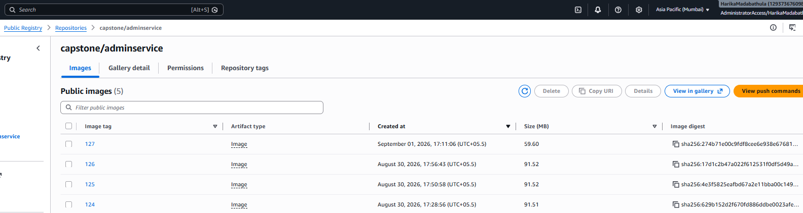

# CICD - Jenkins - DockerImages build and push ECR public - Troubleshooting tips
---

# 1. Path match when compared from Docker file vs Jenkins trigger

## adminService - Dockerfile
```
WORKDIR /app/adminService
COPY backend/adminService/package*.json ./

#Jenkins Docker file location
docker build -t ${repoName}:${IMAGE_TAG} -f ${folder}/Dockerfile .
```

## frontend - Dockerfile - its looking for public/index.html and so have to route differently
```
COPY frontend/package*.json ./

#Jenkins Docker file location
docker build -t ${repoName}:${IMAGE_TAG} -f ${folder}/Dockerfile ./frontend
```

# 2. Image Size Reduction 

Size of backend services are around 90MB, any ways to get it to 60MB
> 


Updated the Dockerfiles and the Jenkinfile - comment DockerCompose - Jenkine in Sync - now the size is around 60MB
> 


# 3. CICD pipeline Time reduction

CICD pipeline completion time is around 10 mins for frontend, any optimizing techniques to reduce the time of completion
> 
